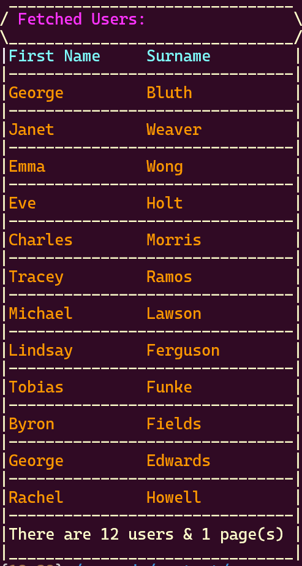

# User REST Client

This Python package is designed to interact with the REST API provided by `https://reqres.in` to fetch and display user data in a paginated format. The package consists of a simple command-line interface that allows users to specify the number of items per page and the page number they wish to view.

The application should look like the below, after installing and executing dependencies.



## Structure

The package includes the following files:

- `__init__.py`: The initialization script for this package.
- `main.py`: The main executable script that provides the CLI.
- `user_client.py`: Contains the `UserClient` class responsible for API interactions.
- `user_dto.py`: Contains the `UserDTO` class that defines the user data structure.
- `requirements.txt`: Lists all the Python package dependencies for this project.

The `__pycache__` directory contains compiled Python files that should not be edited directly.

## Installation

Before running the script, ensure you have Python >= 3.10 installed on your system and install the required dependencies by running:

```bash
pip install -r requirements.txt
```
# Usage
Execute the main.py script to start the application:
```bash
python main.py
```
Follow the on-screen prompts to input the desired page number and the number of users to display per page.

# Features
- Interactive CLI prompts for user input.
- Colorful, formatted output in the terminal for easy reading.
- Error handling with descriptive messages.
- Pagination support with meta information display.
# Contributing
Feel free to fork the repository, make changes, and submit a pull request if you have improvements or bug fixes.